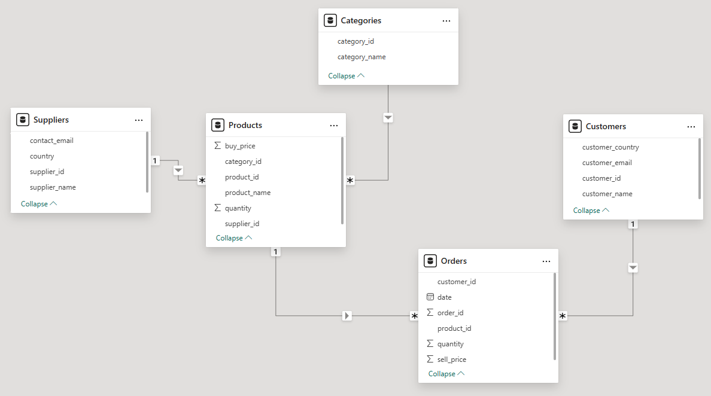
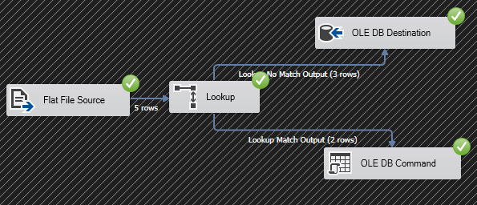
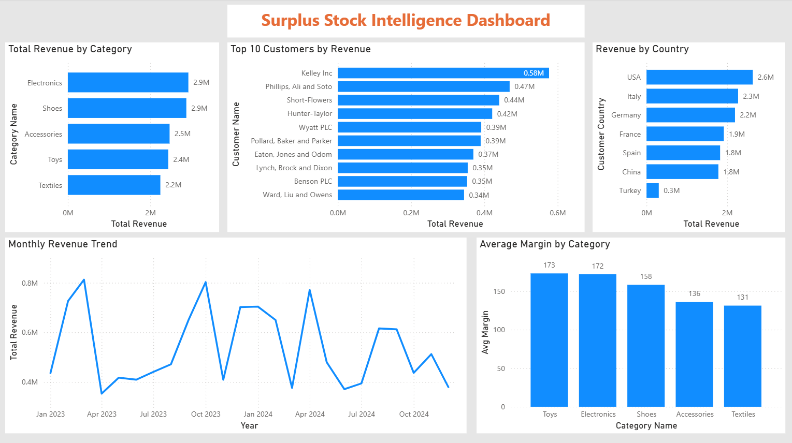

# StockFlow BI
> A Business Intelligence for a B2B surplus inventory operation.

---

## 📌 Project Overview

This project demonstrates a complete BI pipeline built for a B2B surplus inventory business that purchases excess stock from suppliers worldwide and resells it to business customers across multiple product categories including textiles, toys, shoes, accessories, and electronics.

The platform covers every layer of a production BI system: relational database design, automated ETL pipelines, advanced SQL analytics, and interactive dashboards.

---

## 🛠️ Tech Stack

| Layer | Technology |
|---|---|
| Database | SQL Server (Developer Edition) + PostgreSQL 18 |
| Query Language | T-SQL (Advanced) |
| ETL | SSIS (SQL Server Integration Services) |
| Data Generation | Python (Faker, pyodbc) |
| Dashboarding | Power BI Desktop |

---

## 📁 Project Structure

```
SurplusStock-BI/
├── sql/
│   ├── 01_create_tables.sql             # Database schema (SQL Server)
│   ├── 01_create_tables_postgres.sql    # Database schema (PostgreSQL)
│   ├── 02_generate_data.py              # Data generation (SQL Server)
│   ├── 02_generate_data_postgres.py     # Data generation (PostgreSQL)
│   ├── 03_queries.sql                   # Business queries (SQL Server)
│   ├── 03_queries_postgres.sql          # Business queries (PostgreSQL)
│   └── 04_stored_procedures.sql         # Stored procedures
├── etl/
│   ├── SurplusStock_ETL/           # SSIS project - automated ETL pipeline
│   └── new_stock.csv               # Sample supplier stock file
├── powerbi/
│   └── SurplusStock.pbix           # Power BI dashboard file
└── docs/
    ├── dashboard_screenshot.png    # Dashboard preview
    ├── ssis_pipeline.png           # ETL pipeline screenshot
    └── schema_diagram.png          # Entity relationship diagram
```

---

## 🗄️ Database Design

Designed a normalized star schema with 5 tables:

- **Suppliers** : company name, country, contact
- **Categories** : product categories (Textiles, Toys, Shoes, Accessories, Electronics)
- **Products** : name, category, supplier, stock quantity, buy price
- **Customers** : B2B buyer companies across 7 countries
- **Orders** : transactional data linking customers and products with quantity and sell price

All tables are linked via primary and foreign keys ensuring full referential integrity.



---

## ⚙️ ETL Pipeline (SSIS)

Built a production-grade SSIS pipeline that processes incoming supplier stock CSV files automatically.

**Pipeline logic:**
- **Extract** : reads flat CSV file from a monitored folder (simulating supplier file drops)
- **Transform** : casts data types, validates columns
- **Load (smart upsert):**
  - If the product already exists (matched on `product_name` + `supplier_id`) → **UPDATE** quantity
  - If the product is new → **INSERT** new row

This prevents duplicate records and keeps inventory quantities accurate across pipeline runs. Designed to be scheduled via **SQL Server Agent** for automated daily execution in a production environment.



---

## 🔍 SQL Queries

10 business queries covering real analytical needs:

| # | Query | Concepts Used |
|---|---|---|
| 1 | Total revenue by category | GROUP BY, SUM, JOIN |
| 2 | Top 10 customers by revenue | TOP N, GROUP BY, ORDER BY |
| 3 | Monthly revenue trend | YEAR(), MONTH(), GROUP BY |
| 4 | Dead stock detection | LEFT JOIN, IS NULL |
| 5 | Average order value by country | AVG, JOIN, GROUP BY |
| 6 | Sell-through rate by category | Subqueries, calculated fields |
| 7 | Top 5 suppliers by revenue | TOP N, multi-table JOIN |
| 8 | Product contribution per category | CTE, Window Function (PARTITION BY) |
| 9 | Running total of revenue over time | CTE, Window Function (ORDER BY) |
| 10 | Buy price vs sell price margin analysis | AVG, multi-table JOIN, calculated fields |

---

## 📦 Stored Procedures

3 parameterized stored procedures for reusable business reporting:

- **`sales_summary(@StartDate, @EndDate)`** : returns revenue by category for any date range
- **`top_customers(@TopN)`** : returns top N customers by revenue, fully dynamic
- **`flag_low_stock(@Threshold)`** : flags all products below a defined stock threshold, with category and supplier info

---

## 📊 Power BI Dashboard

5 interactive visuals connected directly to SQL Server:

- **Total Revenue by Category** : horizontal bar chart
- **Monthly Revenue Trend** : line chart across 2023–2024
- **Top 10 Customers by Revenue** : horizontal bar chart
- **Average Margin by Category** : column chart (buy price vs sell price)
- **Revenue by Country** : horizontal bar chart across 7 markets



---

## 💡 Key Findings

- **Electronics** is the top revenue-generating category
- **USA** leads in total revenue by country
- **Toys** has the highest average profit margin